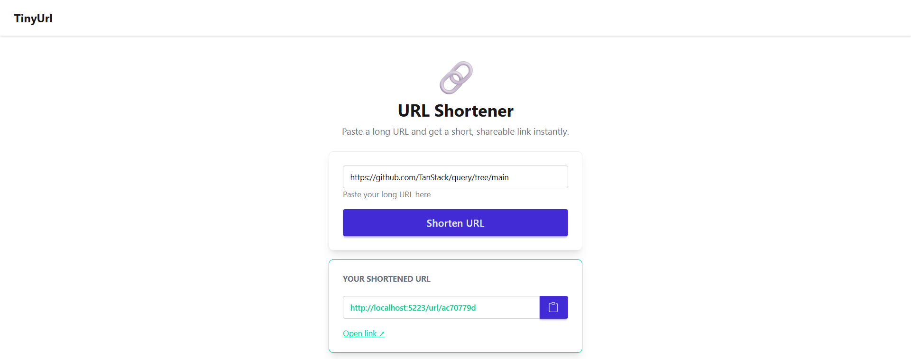

# TinyUrl

A lightweight URL shortener built with ASP.NET Core 10. Paste a long URL, get an 8-character short link, and share it — visiting the short link redirects instantly to the original.

## Screenshot



## Features

- Generate short URLs with an 8-character alphanumeric ID
- One-click clipboard copy of the generated short URL
- HTTP 302 redirect from short URL to original
- Persistent storage via SQLite
- Responsive Bootstrap 5 UI

## Tech Stack

| Layer | Technology |
|---|---|
| Runtime | .NET 10 |
| Web framework | ASP.NET Core 10 (Razor Pages + MVC Controllers) |
| ORM | Entity Framework Core 10 |
| Database | SQLite |
| Frontend | Bootstrap 5, jQuery, jQuery Validation |

## Prerequisites

- [.NET 10 SDK](https://dotnet.microsoft.com/download)
- No external services or databases required

## Getting Started

1. **Clone the repository**
   ```bash
   git clone <repository-url>
   cd TinyUrl
   ```

2. **Apply the database migration**
   ```bash
   dotnet ef database update
   ```
   This creates `sqlite.db` in the project directory.

3. **Run the application**
   ```bash
   dotnet run
   ```

4. **Open in browser**
   - HTTP:  `http://localhost:5223`
   - HTTPS: `https://localhost:7156`

## Contributing & Filing Issues

We welcome bug reports, feature requests, and feedback! Please use our issue templates to help us understand and prioritize your input.

### Report a Bug

Create a [Bug Report](https://github.com/karlrobeck/TinyUrl/issues/new?template=bug.yml) when you encounter unexpected behavior or errors.

**Include:**
- Clear title and description
- Steps to reproduce the issue
- Expected vs actual behavior
- Environment details (OS, .NET version, browser)
- Error logs or screenshots if available
- Severity level (critical, high, medium, low)

### Request a Feature

Create a [Feature Request](https://github.com/karlrobeck/TinyUrl/issues/new?template=feature_request.yml) to suggest improvements or new functionality.

**Include:**
- User story from the perspective of the feature user
- Problem statement — what pain point does this solve?
- Proposed solution — high-level approach
- Acceptance criteria — what needs to be true for this to be "done"
- Priority level (low, medium, high, critical)
- Optional: implementation notes or technical suggestions

### Guidelines

- Search existing issues before filing to avoid duplicates
- Use clear, descriptive titles
- Provide as much context as possible — better details = faster fixes
- Be respectful and constructive in all communications

For general questions, visit [GitHub Discussions](https://github.com/karlrobeck/TinyUrl/discussions).

## Configuration

Connection string and other settings are in `appsettings.json`:

```json
{
  "ConnectionStrings": {
    "Sqlite": "Filename=sqlite.db"
  }
}
```

To use a different SQLite file path, update the `Filename` value. Environment-specific overrides go in `appsettings.Development.json` (already configured with `DetailedErrors: true` for local development).

## Project Structure

```
TinyUrl/
├── Controllers/
│   └── UrlController.cs      # Handles short URL redirect (GET /url/{id})
├── Data/
│   └── AppDbContext.cs        # EF Core DbContext
├── Migrations/                # EF Core migration files
├── Models/
│   └── ShortUrl.cs            # ShortUrl entity (Id, OriginalUrl, CreatedAt)
├── Pages/
│   ├── Index.cshtml           # Home page — URL input form and result display
│   └── Index.cshtml.cs        # Page model — handles form POST and URL creation
├── wwwroot/                   # Static assets (CSS, JS, Bootstrap, jQuery)
├── appsettings.json           # Application configuration
└── Program.cs                 # App startup, DI registration, middleware pipeline
```

## API Reference

### Redirect to original URL

```
GET /url/{id}
```

| Parameter | Type | Description |
|---|---|---|
| `id` | `string` | 8-character short URL ID |

**Responses**

| Status | Description |
|---|---|
| `302 Found` | Redirects to the original URL |
| `404 Not Found` | No URL found for the given ID |

## Known Limitations

- **No collision handling** — IDs are generated from the first 8 hex characters of a GUID. Collisions are unlikely but not protected against.
- **No server-side URL validation** — the server only checks that the input is non-empty; URL format is validated client-side only.
- **No authentication or rate limiting** — the app is open to abuse if exposed publicly without a reverse proxy or WAF.
- **No click tracking** — `CreatedAt` is stored but not surfaced in the UI.

## License

MIT License

Copyright (c) 2026

Permission is hereby granted, free of charge, to any person obtaining a copy
of this software and associated documentation files (the "Software"), to deal
in the Software without restriction, including without limitation the rights
to use, copy, modify, merge, publish, distribute, sublicense, and/or sell
copies of the Software, and to permit persons to whom the Software is
furnished to do so, subject to the following conditions:

The above copyright notice and this permission notice shall be included in all
copies or substantial portions of the Software.

THE SOFTWARE IS PROVIDED "AS IS", WITHOUT WARRANTY OF ANY KIND, EXPRESS OR
IMPLIED, INCLUDING BUT NOT LIMITED TO THE WARRANTIES OF MERCHANTABILITY,
FITNESS FOR A PARTICULAR PURPOSE AND NONINFRINGEMENT. IN NO EVENT SHALL THE
AUTHORS OR COPYRIGHT HOLDERS BE LIABLE FOR ANY CLAIM, DAMAGES OR OTHER
LIABILITY, WHETHER IN AN ACTION OF CONTRACT, TORT OR OTHERWISE, ARISING FROM,
OUT OF OR IN CONNECTION WITH THE SOFTWARE OR THE USE OR OTHER DEALINGS IN THE
SOFTWARE.
